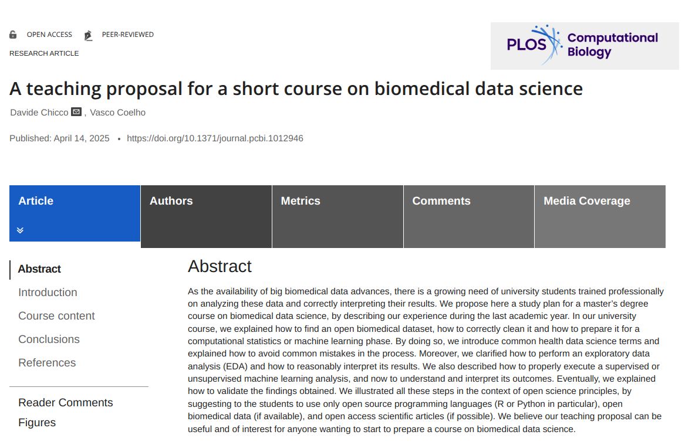

# Teaching material for the course Medical Informatics – Public Health Data Science
Teaching course of the Data Science master degree programme at Università di Milano-Bicocca, formerly known as Data in Public and Social Services – Data Science Lab in Public Policies and Services.

## Contents
This repository contains the text of the practical classes taught to the students of the short course called *Medical Informatics* (formerly *Data in Public and Social Services*) of the Data Science master degree programme at Università di Milano-Bicocca.
Students can find the text of the excercises and their corresponding R code in the PDF files of the `PDF_doc` folder:

* [1st practical class: data cleaning and preparation](https://github.com/davidechicco/BiomedicalDataScience/blob/main/PDF_doc/1st%20practical%20exercise%20class%20-%202024-03-25.pdf)
* [2nd practical class: exploratory data analysis and dimensionality reduction](https://github.com/davidechicco/BiomedicalDataScience/blob/main/PDF_doc/2nd%20practical%20exercise%20class%20-%202024-04-08.pdf)
* [3rd practical class: clustering](https://github.com/davidechicco/BiomedicalDataScience/blob/main/PDF_doc/3rd%20practical%20exercise%20class%20-%202024-04-15.pdf)
* [4th practical class: supervised machine learning](https://github.com/davidechicco/BiomedicalDataScience/blob/main/PDF_doc/4th%20practical%20exercise%20class%20-%202024-04-22.pdf)

## Requirements
To run the scripts of the excercises of repository, the student needs to install the following R packages:
* R (version >= 4.0)
* R libraries: `dlookr`, `dplyr`, `ggplot2`,  `pastecs`, `tableone`, `umap`, `textshape`, `factoextra`, `ggdendro`, `fpc`, `cluster`, `ggdendro`, `clusterSim`, `parameters`

## License
All the files of this repository are publically and openly available under the GPL-3 license.

## Article
More information about this study can be found in the following article:

> Davide Chicco and  Vasco Coelho, ["A teaching proposal for a short course on biomedical data science"](https://doi.org/10.1371/journal.pcbi.1012946), _PLOS Computational Biology_ 21(4):e1012946, 2025. [https://doi.org/10.1371/journal.pcbi.1012946](https://doi.org/10.1371/journal.pcbi.1012946)

## Contacts
The lesson contents and software code were designed and developed by [Davide Chicco](https://www.DavideChicco.it). Questions should be addressed to davidechicco(AT)davidechicco.it
